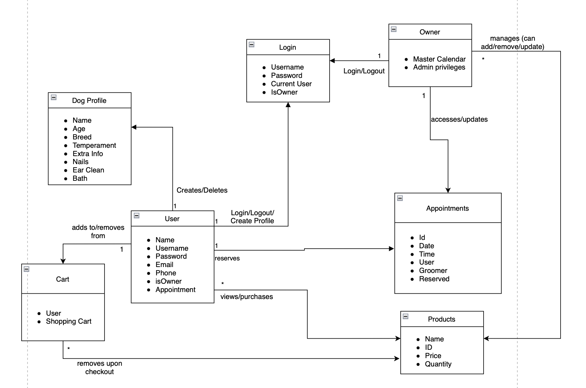
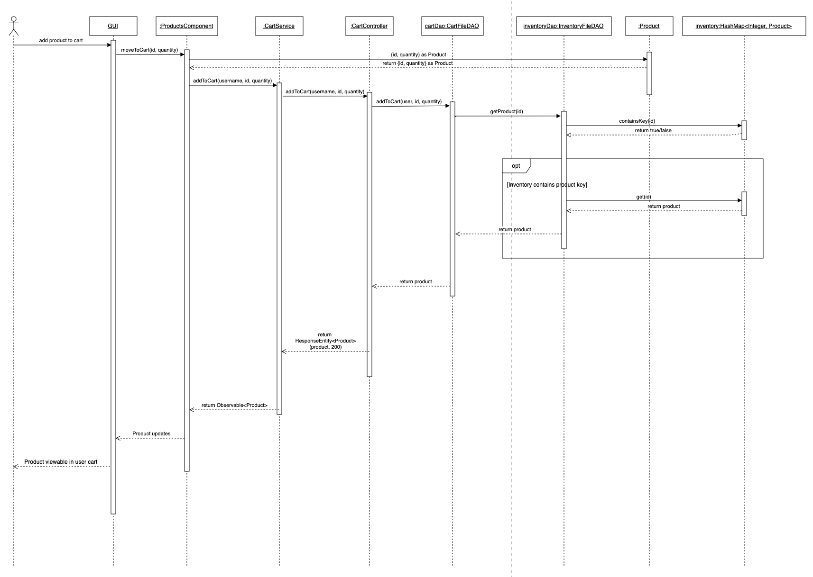
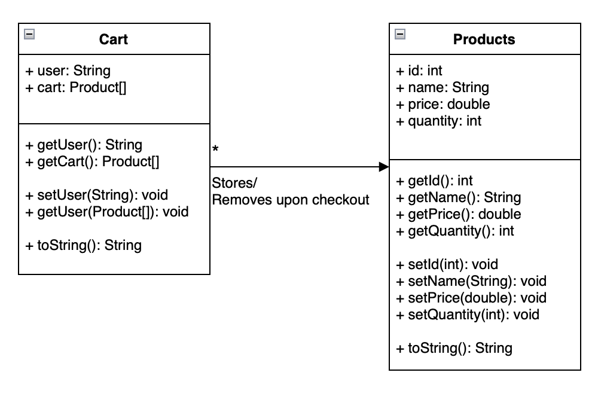
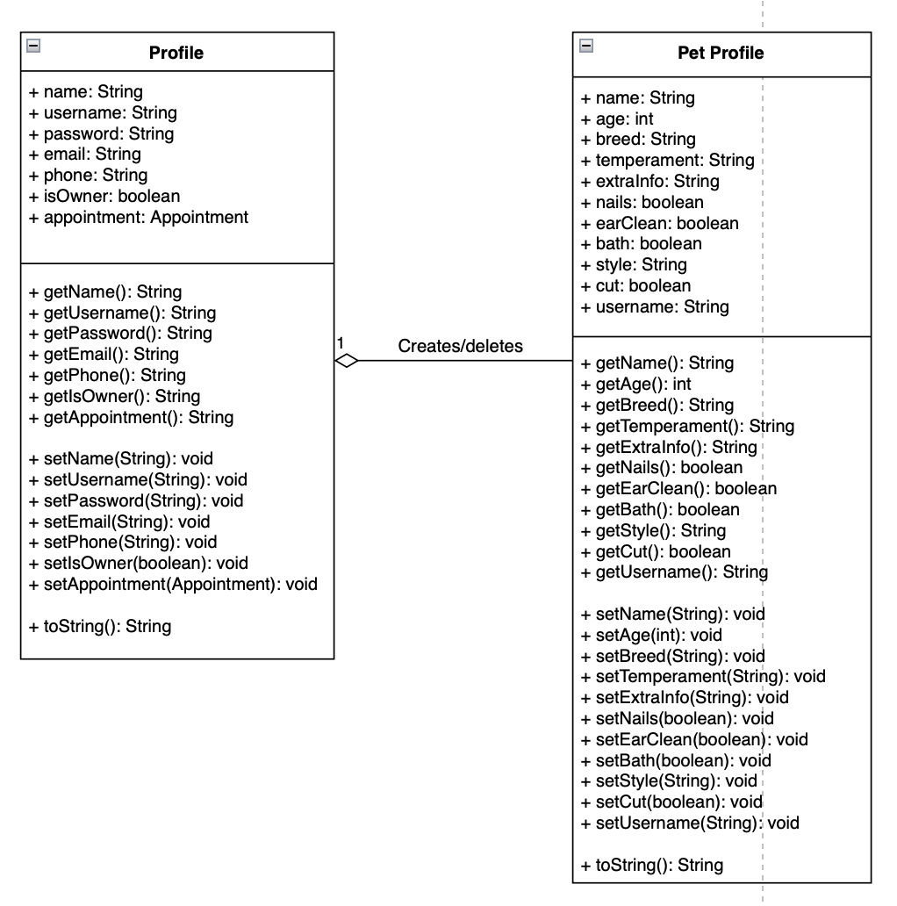
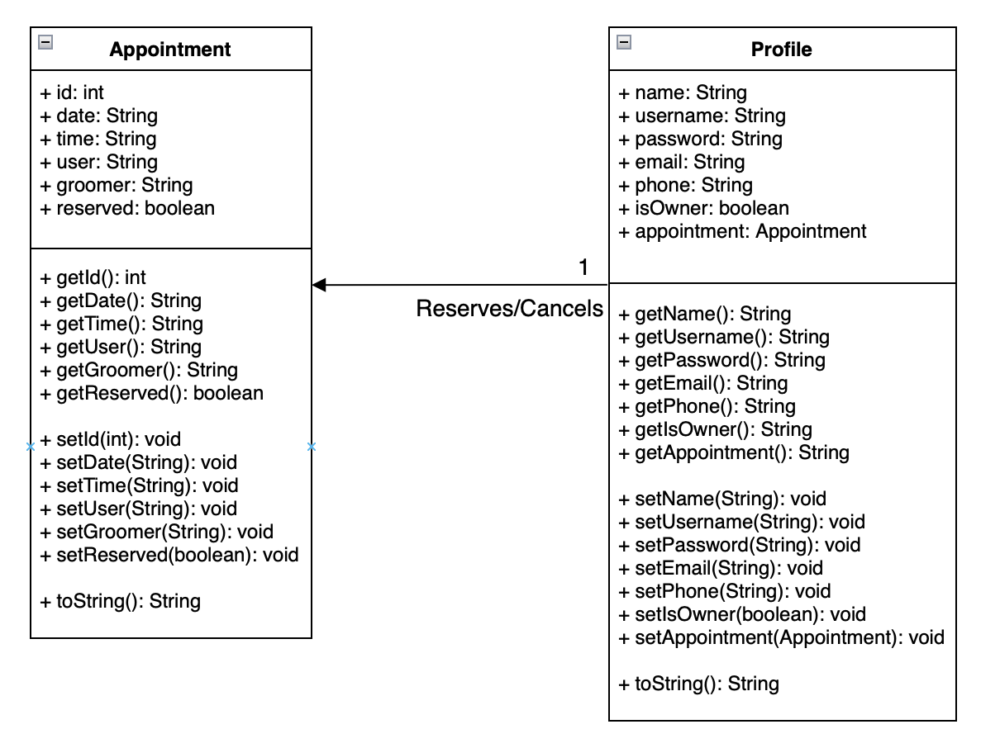

# PROJECT Design Documentation

## Team Information
* Team name: Puprize!
* Team members
  * Kaitlynn Clement
  * Rafael Rivera
  * Paul Curcio
  * Jade Condez
  * Hunter Boggan

## Executive Summary
This is a summary of the project.

### Purpose
Our project is called Puprize! and we are an online estore for a dog grooming salon where you can book appointments and buy dog grooming supplies. Users can create profiles to store products in their shopping cart and can also create a profile(s) for their pet(s) to store readily accessible information about their pets for when they book an appointment. 

### Glossary and Acronyms
| Term | Definition |
|------|------------|
| SPA | Single Page |

## Requirements
This section describes the features of the application.

### Definition of MVP
Our estore needs to be able to support user authentication through a login application along with allowing for a separate login for the owner to be able to give more access to the owner to modify the products page by adding products, updating stock, removing stock, and deleting products as well as changing the order of the display. A user also needs the ability to buy products, search for products, add products to their unique cart that saves to their profile, and finally checkout the products.

### MVP Features
Change products page, update stock, add/remove items to/from the shopping cart, browse products, create an estore owner login, get entire inventory, search for a product, get a single product, create a new product, update a product, delete a product.

### Roadmap of Enhancements
Appointments
Pet profiles
Services
FAQ

## Application Domain
This section describes the application domain.

The most important domain entities are the Appointments component, the Login Component, and the Products Component. The login component is required to identify whether or not the user is an admin, and if so, can change the look and functionality of the appointments and products pages. In other words, the login component will update the functionality of the appointments and products. The appointment and products are not related, but are both accessed by the user. The shopping cart component is updated by the products component, and the shopping cart updates the products once the shopping cart is checked out.

The Products component is part of the MVP features and provides user functionality for searching for items, adding items to their cart and browsing the inventory. As well as admin functionality for adding new products, updating existing products or removing existing products. 
 
The appointments component is one of our two 10% features and is a key aspect of our grooming website as it allows users to make appointments at our grooming salon, our purpose. The appointments page also features several features such as the master calendar that shows all available appointments and the ability to reserve a date and time when logged in as the user. When reserving this will also affect the overall view of the appointments component as it will not allow a user to reserve multiple appointments. It will also update the view of the profile component to showcase this reserved appointment.

## Architecture and Design
This section describes the application architecture.

### Summary
The following Tiers/Layers model shows a high-level view of the web app's architecture.

The e-store web application, is built using the Model–View–ViewModel (MVVM) architecture pattern. 

The Model stores the application data objects including any functionality to provide persistence. 

The View is the client-side SPA built with Angular utilizing HTML, CSS and TypeScript. The ViewModel provides RESTful APIs to the client (View) as well as any logic required to manipulate the data objects from the Model.

Both the ViewModel and Model are built using Java and Spring Framework. Details of the components within these tiers are supplied below.

### Overview of User Interface
This section describes the web interface flow; this is how the user views and interacts
with the e-store application.

The website opens to the home page where there is a top navigator bar the user can use to navigate between different pages of the website. These pages are the products, cart, profile, FAQ, services, login, and appointments. Login also directs you to the home page upon a successful login attempt.

### View Tier
There is the home component that is what you see upon initially starting the website. Home offers information to the user such as the location of the salon, contact information, and a description of the salon. From the home page you can navigate to the following components; appointments, cart, FAQ, services, login, products, and profile. Upon entering the website, the user should log in to be able to access their profile information so that they can shop and book appointments. They will navigate to the login page using our navigation bar. The login component is responsible for handling all login requests and updating the current user profile signed in on the page. If an invalid username or password is entered, the login fails. A user can create a new profile to log in with if they do not have credentials. Otherwise, the user can type in their username and password, and they will be greeted by a welcome message upon successful login. The owner has a special username and password to use on the login screen. 

return this.http.put(`${this.url}/?username=${username}&password=${password}`, {
    username,
    password
  }).pipe(tap(_ => this.log('login attempt: ' + username + " " + password)),
  catchError(this.handleError<any>('tryLogin')));

  After the user has successfully logged in they can now navigate to the products page and be able to add and remove products to their shopping cart. They can also view all the products currently available in the inventory and search for products in the inventory (note that products with 0 quantity do not appear for a user, even when searching). When logged in as an admin, the user cannot add products to a shopping cart, but every product can still be viewed and searched for (note that both of these actions now display products with 0 quantity). The admin also has the ability to create new products, giving it name, price and quantity and having an ID automatically generated for it. The admin can remove products, or change the price and/or quantity of a product as well. 

   return this.http.get<Product[]>(this.productUrl)
    .pipe(tap(_ => this.log('got all products')),
    catchError(this.handleError<Product[]>('getProducts', [])));

  After adding a product to their cart they can then navigate to the cart page to view their cart and any products stored in the cart. If there are no products in the cart it will display a message saying there are no products currently in the cart and if they would like to add some to navigate to our products page. For products in the user cart they can remove a selected amount, or empty their entire cart. Lastly there is the checkout button that will checkout all products currently in the cart, this will bring up a form for a user to enter in their information such as their address and credit card information. Upon completion of the form it will display a message saying the checkout was successful and their total price. Now the cart will be empty as they have bought the products. The owner account is not allowed to have a cart and upon navigating to the page it will display a warning message prompting them to log in as a user to enter products into their cart.

  

  return this.http.post<Product>(this.cartUrl, product, this.httpOptions).pipe(
      tap(_ => this.log(`moved quantity=${product.quantity} product(s) of id=${product.id} to cart}`)),
      catchError(this.handleError<Product>('moveToCart'))
    );

  

  The user can also navigate the appointments page where they will see a calendar for the month where each weekday is a clickable object. By clicking on one of the days, the user will be taken to another page which shows the list of appointments. If the user is not logged in, they will see a message saying the user is required to log in before viewing appointment times. When logged in, available appointments will have a “Confirm Reservation” button available for users to click and reserve appointments, and those that are not available will show a message that there is no appointment available for this time. If a user is logged in and already has an appointment scheduled, they will not be able to view any appointment times or schedule another appointment until they cancel their current appointment. As an owner, the calendar dates can be clicked on and the owner will be rerouted to a page with a list of all appointments for that day. On this page the owner can view the information of every appointment and update the groomer name or reservation status(note: the owner cannot force reserve/block an appointment that is already scheduled). The owner must click the “Save Changes” button in order for these changes to be implemented. Other owner actions like deleting or adding, as seen in other portions of the site, are not available for appointments. 

  

  The user can view their profile after logging in by navigating to the profile page. Here if they are not logged in they will be asked to redirect to the login page so that they can view their information. If they are logged in they will be shown a list of their profile information such as their name, username, password, phone, and email. Along with this, if they have an appointment booked, this information will also display, else it will say no appointment currently reserved. Lastly, if a user does not have a pet profile they will have a button with the option to create one, prompting the user to enter in the now visible form of pet information. The fields are name, age, breed, temperament, extra info, nails, bath, cut, and style. They can then create their pet profile and view the information about their pet. There is also the option to delete their pet profile and make a new one. A user can only make 1 pet profile at a time. The owner can view their profile information as well but they will not see any appointment information and do not have the ability to create a pet profile.

  

  

  The user can view the grooming salon's FAQ page to get information about the salon. This is purely HTML so there is no ability to edit/update this page. 

  The user can view the grooming salon's offered services and their respective prices on the services page. There are four services with descriptions and prices displayed in a slideshow on the services page, along with complementary photos. The services page does not provide functionality, just information, and as such it can be viewed when logged in as the admin, a user, and even when not logged in at all. The only interactable parts of the services page would be clicking through the slideshow instead of having to wait for the slides to change. 

### ViewModel Tier
In our ViewModel, we have the ProductController, LoginController, ProfileController, CartController, AppointmentController, and PetProfileController. Each of these controllers is a mediator between the classes in the View and the classes in the Model. Each handles http requests coming from the view and updates the model in the appropriate way by calling the respective model methods. ProductController handles http requests done on the products page and will call DAOs in the model to create, read, update, or delete a product in the model. LoginController handles http requests done on the login page and will create and delete login attempts in the model. ProfileController, PetProfileController, CartController, and AppointmentController all do tasks similar to ProductController, but they are separated for better cohesion. 

### Model Tier
In our Model, we have the Product, Login, Profile, PetProfile, Cart, and Appointment classes, as well as the three sort classes, NameSort, PriceSort, and QuantitySort. The three sort classes are used by the InventoryFileDAO, which creates, reads, updates, deletes, and sorts Product objects from the product.json file. Each back-end file (excluding the sort files) provides functionality for creating and managing objects of the corresponding types. For example, the Products.java file allows for the creation of a Products object, each with their own name, id, price and quantity.
Also inside the Model are the FileDAO files, those being AppointmentFileDAO, ProfileFileDAO, CartFileDAO, PetProfileListFileDAO, and InventoryFileDAO. AppointmentFileDAO, InventoryFileDAO, PetProfileListFileDAO and ProfileFileDAO process commands from the Controller and interact with the ViewModel in the back-end, updating their respective .json files. CartFileDAO also manipulates products, but it modifies the cart.json file for a user-specific shopping cart.  

### Static Code Analysis/Design Improvements
To improve the design, our team would most likely try to find ways to input check and check every scenario a user might create. There are many edge cases that have to be considered when making an application such as handling negative and zero values, empty username and password fields, trying to create a product with an empty name, etc. There are also issues that may arise when a solution is implemented for another issue: we had this problem once, so it would be a good idea to track all of these edge cases so that they can be re-tested when the design is updated. 
When running the Static Code analysis, we were able to edit our HTML tags to get rid of all of the front-end bugs, changing "i" tags to "em" and "b" tags to "strong". These tag changes gave us functional as well as semantic differences, able to be more accurately translated to different application hosts (such as a unit that would run an application for a visually impaired user). 
The Calendar has also provided issues in terms of design, as the colors of the links that take you to different pages can be hard to see and may be very challenging to see for those who are visually challenged. The colors of the links and/or the background could be re-planned in order to ease the experience of the user. 
For our estore-ui, to update and store the current user for all pages in our estore, we implemented a function called "getCurrentUser()" in almost all of our component.ts files. But, this requires a lot of repetition of code that seems unecessary. Potentially we would seek to change this and allow for a design that adheres better to the principle of low coupling.

## Testing

### Acceptance Testing
Overall, we have 21 user stories that have passed all their acceptance criteria tests. The stories that have not passed are the stories that we were unable to implement in sprint 4 that will not be in our final project implementation due to time constraints along with refactoring of our priorities. There are 12 user stories in our sprint backlog that will not be developed, but, these were all low-priority stories that ranged from only 1-3 story points, with one outlier of Pet Profile Images being 8. These were additional features we were hoping to implement if time was willing. Otherwise, for our user stories that have passed all their acceptance criteria tests, we experienced issues with our create a profile user story as we experienced an error where it was not creating the profile and it was also not logging in the newly created profile. There was also an error with the pet profile where it was also not creating the pet profile. These are 2 examples of bugs we encountered while coding that were eventually fixed.

### Unit Testing and Code Coverage
For our unit testing we made sure to cover every file in our estore-api to ensure high code coverage and to properly test all aspects of our webpage. This is especially vital for many of our new classes that were created along with their controllers as that is our main communication from the backend to the front end and vice versa. Our goal was/is to achieve 90% code coverage overall for our project and so far this has been achieved. Our model is 100% covered. Since the model covers the class object files themselves, the testing of their methods along with their creation did not pose an issue, allowing us to get full code coverage. In our controller we have above 90% code coverage. Our login controller posed the biggest challenge as its functionality differs heavily from those of the other controllers due to its unique task of handling all login requests. So, the code coverage for loginController is not as high compared to the other controllers due to the difficulty of testing its methods as they have many conditions we would need to check for. Our persistence has a code coverage of above 90% that covers testing of our DAO files along with sort methods we use for our products page. Our InventoryFileDAO and our ApointmentFileDAO posed difficulty as these files both contain functions with many conditions to check for but we ensured to test as much as possible to ensure our functions worked correctly.

